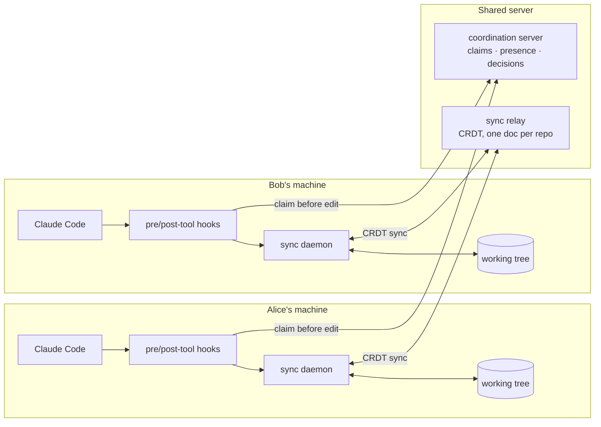

# Hivemind

[](https://github.com/josephhaenel/Hivemind/actions/workflows/ci.yml)

**Multiplayer for AI coding agents.** Two or more people coding the same repository — each with their own Claude Code / Codex session — without overwriting each other's work, and seeing each other's changes live.

> Pair-programming and mob-programming tools assume *humans* typing. AI agents don't type — they rewrite whole functions and files in a single shot. That breaks the usual assumptions, and it's the problem this project is built around.

---

## Why this is a hard problem

When two people each drive an AI agent against the same codebase, two things go wrong fast:

1. **Silent clobbering.** Agents rewrite entire functions atomically. If two agents touch the same function, a naïve character-level CRDT will happily *merge* both rewrites into something that compiles-but-is-wrong. Convergence is not correctness.
2. **No shared awareness.** Each agent has its own context window. Neither knows what the other is doing, deciding, or about to overwrite.

So the core insight driving the design: **the CRDT is only transport + convergence. The actual value is collision *avoidance* — claiming a region of code *before* writing to it.**

---

## What it does

- **Collision avoidance, down to the symbol.** Before an agent edits, it *claims* the region — at the level of the **individual function/symbol**, so two agents can safely work in the same file at the same time. If another agent holds it, the edit is refused (agent-vs-agent → hard block; a human involved → soft warn). Enforced at the Claude Code hook **and**, optionally, at the sync daemon — so even a plain-editor save can't bypass it.
- **Live file sync.** Edits propagate between collaborators' working trees in real time over a shared CRDT.
- **A shared brain that learns.** Teams record "decisions" — constraints, conventions, interface contracts. The relevant ones are **auto-injected into the agent the moment it claims a file to edit** (on the human-involved path too), so the team's rules reach the agent exactly when they matter — no prompting, no pull. Agents can also **ask** it (`hive ask "what's our error-handling convention?"`), it **flags contradictions** when a new decision opposes a live one, and it **self-populates** — `hive capture` surfaces your recent edits that still need a decision recorded. All keyword/heuristic and dependency-free; an optional LLM layer is a future seam.
- **Live awareness dashboard.** The coordination server serves a dark, auto-refreshing web view of who's online, who's editing what, and recent decisions — open `https://<server>/` and enter the token.
- **Durable + secure.** Persistence (decisions survive restarts) and a shared-secret auth token for remote deployments.

---

## How it works



Two planes:

- **Control plane (claims + shared brain).** A Claude Code `PreToolUse` hook calls the coordination server to claim the target region before an `Edit`/`Write`; `PostToolUse` releases it. The coordination server is a single, linearizable authority that hands out **fence tokens** so a stale lease can never overwrite a newer one. A successful claim also returns the decisions relevant to that file/symbol, which the hook surfaces to the agent — so "claim the code" and "learn the local rules" are the same step.
- **Data plane (sync).** A per-machine daemon mirrors the gitignore-scoped working tree into a shared [Yjs](https://yjs.dev) CRDT via a relay: local writes become CRDT edits; remote edits get written back to disk. A "shadow" map breaks the feedback loop in both directions.

The two planes compose: the daemon can check a claim before broadcasting a local edit, so collision avoidance covers edits that bypass the hook entirely.

---

## Repository layout

| Path | What |
|---|---|
| [`packages/coordination-mcp-server`](packages/coordination-mcp-server) | Claims / presence / decisions. An MCP server (`hive_claim`, `hive_whos_editing`, `hive_post_decision`, …) plus REST shims for the hooks. Fence tokens, TTL+heartbeat leases, party-dependent policy. |
| [`packages/sync-relay`](packages/sync-relay) | Minimal Yjs CRDT websocket relay — one document per repo, fans updates out to peers. |
| [`packages/sync-daemon`](packages/sync-daemon) | Per-machine disk⇄CRDT mirror; optional daemon-side claim enforcement. |
| [`docs/design`](docs/design) | The full design specs (see below). |
| [`deploy`](deploy) | One-command self-host setup for a VPS (Caddy + TLS + systemd + firewall). |
| [`examples`](examples) | Runnable end-to-end demos. |

---

## Try it locally (no setup)

```bash
npm run install:all
npm run build
npm run demo          # collision avoidance + live sync together
npm run demo:enforce  # a hook-bypassing edit gets blocked & reverted
npm run demo:persist  # state survives a relay restart
npm test              # coordination core (unit tests)
```

`npm run demo` spins up the coordination server, the relay, and two daemons on two temp dirs, drives the real Claude Code hooks, and proves the whole loop: same file → blocked, different files → fine, edits sync live, release frees the region.

## Use it with real Claude Code, or host it for your team

- **Local / one machine:** see [QUICKSTART.md](QUICKSTART.md).
- **Self-host on a VPS (for you + collaborators):** see [deploy/README.md](deploy/README.md) — one script sets up TLS (via `sslip.io`, no domain required), a non-root service user, systemd, a firewall, and an auth token, then prints the exact connection settings your collaborators paste in.

---

## Design docs

This was designed spec-first, and the specs are worth reading on their own:

- [`docs/design/sync-loop.md`](docs/design/sync-loop.md) — the git-baseline ↔ CRDT-overlay synchronization model (the production target: epochs, durable landing, offline reconnect, conflict-as-data).
- [`docs/design/coordination-mcp.md`](docs/design/coordination-mcp.md) — the claims/presence/decisions layer (region identity, fencing, the agent-vs-human policy, partition behavior).

Both specs were produced and **adversarially hardened** with multi-agent workflows — independent agents designed each dimension, then a panel of skeptics attacked the design and the holes were folded back in. Mechanisms in the specs are tagged with the specific failure scenario they defend against.

---

## Status & scope

This is a working **MVP, deployed and live**: collision avoidance (file **and** symbol level), live sync, the auto-injected decisions brain, live presence, persistence, and auth all function and are covered by demos/tests. Current simplifications (tracked toward the production design in the specs):

- the CRDT is the live state (the git-baseline/epoch landing model is specified, not yet built);
- text files only, under 512 KB; rename = delete+create;
- shared-token auth (good for a team you invite; multi-user accounts are a later milestone);
- conflict-as-data (diff3) is deferred — a CRDT lacks the shared ancestor diff3 needs, so concurrent same-region edits are kept safe by block/revert rather than three-way merge.

Contributions and ideas welcome — start with the design docs.

## Roadmap

All four planned milestones have shipped and are deployed live (full detail + what's next in [docs/ROADMAP.md](docs/ROADMAP.md)):

- ✅ **CI & tests** — build + test + integration demos on every push.
- ✅ **Frictionless onboarding** — `hive init` wires the hooks, registers the MCP server, and writes a `CLAUDE.md` in one command; `hive up` / `hive status`. *(Remaining: publish to npm for clone-free `npx @hivemind/cli`.)*
- ✅ **Agents use the shared brain** — relevant decisions are auto-injected at claim time; agents also get `hive who` / `hive decisions` / `hive decide` and the matching MCP tools.
- ✅ **Awareness dashboard** — a live web view of who's online, claims, presence, and decisions.
- ✅ **Region-level claims** — a dependency-free symbol resolver lets two agents edit different functions in the same file. *(diff3 conflict-as-data intentionally deferred — see Status & scope.)*

**Next:** the git-baseline/epoch landing model, live dashboard push (SSE instead of polling), and richer symbol resolution.

## License

[MIT](LICENSE) © Joseph Haenel
